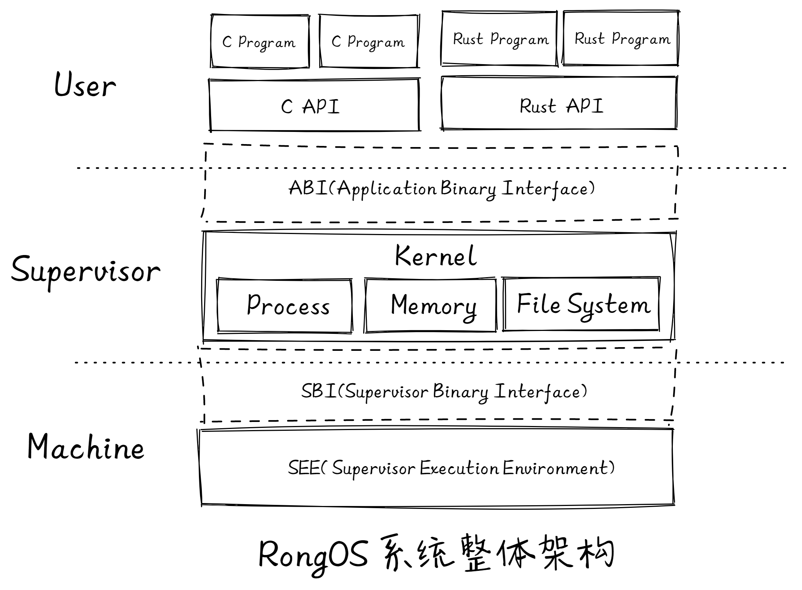

# 项目起源

RongOS 为了避免重新“造轮子”，因此在开发前期面临过一个选择，是基于 MIT 6.828课程的 xv6 教学系统，还是基于清华大学的 rCore-Tutorial-v3，对于这一点我们做了很多思考与比较。

主要由以下三点原因最终决定了我们选择 **rCore-Tutorial-v3** 作为基石。

1. **编程语言的选择**

   xv6 采用的是传统的 c 语言，而 rCore-Tutorial-v3 则是使用新型的 Rust。由于 c 语言因为历史原因导致其在一些方面并没有很好的处理机制，如指针、内存泄漏、并发漏洞等，而 Rust 语言首先具有与 c 语言一样的硬件控制能力，其次它大大强化了安全编程和抽象编程能力。从某种角度上看，新出现的 Rust 语言的核心目标是解决 C 的短板，取代 C 。所以用 Rust 写操作系统内核具有很好的开发和运行体验，这是 rCore-Tutorial-v3 采用 Rust 语言的原因。对于我们来说，出于好奇心与强烈的挑战欲望，我们更喜欢崭新的、带有独特机制的、以及目前被多家顶尖科技公司看好的 Rust 语言。

2. **社区支持**

   xv6 book 是一个pdf文件，最新更新时间为 2021年9月6日。rCore-Tutorial-Book-v3 以网站的形式部署在 github pages 上，相比下具有较好的可读性，知识点的寻找更为便捷。并且，rCore-Tutorial-v3（包括 rCore-Tutorial-Book-v3 ） 的更新更为频繁，在我们的项目开发期间，rCore-Tutorial-v3 一直在进行着频繁的小更新，完善功能，修正错误。最为重要的是，rCore-Tutorial-Book-v3 在每一章节下方设定了讨论区，对于不理解的地方可以随时提出，且回复效率极高。通过密切地与其他学习者、开发者进行讨论交流，我们在项目开发途中解决问题的难度大幅下降。

3. **自然语言环境**

   诚然，每个合格的计算机学子应该要具备阅读外文文献的能力。但我们对于自身的英语能力仍感到心有余而力不足。对于一个需要从头学到尾、时刻跟踪的项目来说，我们觉得采用母语的教程会大幅提高我们的学习与开发效率。

**非常感谢清华大学陈渝老师与吴一凡同学等开发者编写的 rCore-Tutorial-v3！**

# 系统整体架构

借鉴《Operating Systems: three easy pieces》的撰写想法（即虚拟化、并发、持久化），我们将 RongOS 也分成了三个主体部分以及各自的子模块：

1. 进程管理
   - 进程调度与进程切换
   - 进程的创建与释放
   - 进程资源管理
   - 同步与互斥
2. 内存管理
   - 虚拟文件系统
   - FAT32 文件系统驱动
   - 管道、设备文件
   - 磁盘缓冲层
3. 文件系统
   - 内存页面管理
   - 小块内存管理
   - 虚拟地址空间管理
   - 缺页处理机制

# 项目特征

- Rust语言编写
- 多核操作系统
- 支持59条系统调用
- 高性能优化：内存弱一致性优化、lazy与CoW、文件系统双文件块缓存等优化等机制
- 信号机制：进程支持进程信号软中断。
- 支持C语言程序和Rust语言用户程序编写和运行（提供回归测试基础）
- FAT32虚拟文件系统
- 混合调试工具：Monitor（结合静态宏打印以及动态gdb特性）
- 详细项目文档、开发过程支持以及理解友好型代码构造和注释

# 项目文件描述

- bootloader：
- doc：
- fat32-fuse：
- os：
- simple-fat32：
- user_c：

