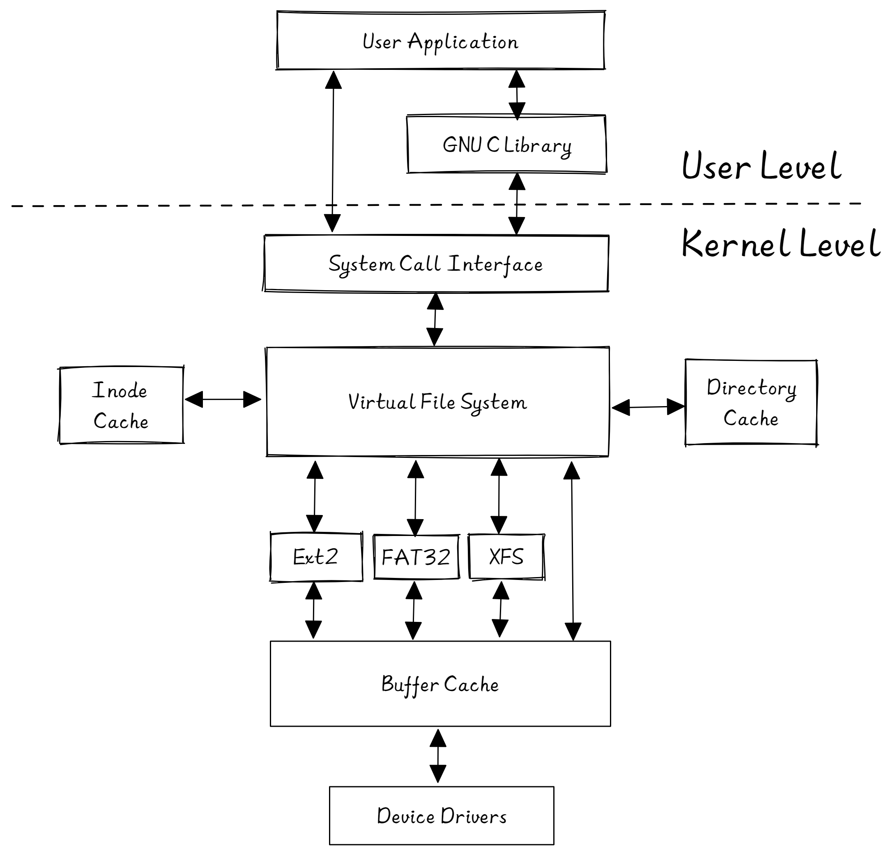

# 虚拟文件系统

虚拟文件系统（Virtual File System，VFS）是一个内核软件层，在具体的文件系统之上抽象的一层，用来处理与文件系统相关的所有系统调用，表现为能够给各种文件系统提供一个通用的接口，使上层的应用程序能够使用通用的接口访问不同文件系统，同时也为不同文件系统的通信提供了媒介。



VFS 为了提供对不同底层文件系统的统一接口，需要有一个高度的抽象和建模，这就是 VFS 的核心设计——**统一文件模型**。目前的 Linux 系统的 VFS 都是源于 Unix 家族，因此这里所说的 VFS 对所有 Unix 家族的系统都适用。Unix 家族的 VFS 的文件模型定义了四种对象，这四种对象构建起了统一文件模型。

- Superblock：存储文件系统基本的元数据。如文件系统类型、大小、状态，以及其他元数据相关的信息（元元数据）
- Index node（inode）：保存一个文件相关的元数据。包括文件的所有者（用户、组）、访问时间、文件类型等，但不包括这个文件的名称。文件和目录均有具体的 inode 对应。
- Directory entry（dentry）：保存了文件（目录）名称和具体的 inode 的对应关系，用来粘合二者，同时可以实现目录与其包含的文件之间的映射关系。另外也作为缓存的对象，缓存最近最常访问的文件或目录，提升系统性能。
- File：一组逻辑上相关联的数据，被一个进程打开并关联使用。

但相较于 Linux，RongOS 可以说是非常简单，因此我们的 VFS 层并没有完全按照 Unix 的文件模型，而是自己设计了一个 OSInode 结构用于进程访问。

```rust
pub struct OSInode {
    readable: bool,
    writable: bool,
    inner: Mutex<OSInodeInner>,
}

pub struct OSInodeInner {
    offset: usize,
    inode: Arc<VFile>,
}
```

我们将读写属性放在外面，将文件实际内容包括文件当前偏移量放在了 OSInodeInner 中，这样做的好处是无需取得互斥锁即可先进行权限判断，可以提高系统整体性能。

注意，这里的 VFile 类型是由下一级文件系统提供（即后续会提到的 Simple-FAT32）。

为了实现文件系统相关的系统调用，我们为 OSInode 提供了以下接口：

- new：新建一个 OSInode 对象，其中 inner.inode（即 VFile 对象）由形参传入。
- delete：删除文件，在文件系统中删除目录项且清空文件数据。
- read：读取文件内容保存到缓冲区中
- write：将缓冲区中的数据写入到文件中
- get_fstat：获取文件状态信息
- get_dirent：获取目录文件的目录项信息

在 inode.rs 文件中，还包含以下两个重要接口：

- open：根据工作目录、文件路径、打开方式三个参数打开（或创建）一个文件，返回 OSInode 对象的引用
- chdir：修改进程当前的工作目录

# 文件系统初始化

在 inode.rs 中，有如下代码：

```rust
lazy_static! {
    pub static ref ROOT_INODE: Arc<VFile> = {
        let fat32_manager = FAT32Manager::open(BLOCK_DEVICE.clone());
        Arc::new(create_root_vfile(&fat32_manager)) // 返回根目录
    };
}
```

这里使用到了 Rust 的 lazy_static 宏定义，它的作用是对全局变量初始化进行延迟，即首次使用时才进行初始化。

对 ROOT_INODE 的初始化分两步：

1. 打开文件系统，获得文件系统管理器对象，其中会初始化 FAT32 文件系统。（详见 3-FAT32 ）
2. 创建根目录的 VFile 对象，也即 ROOT_INODE，接下来内核所有的文件系统操作都是以它为基础。

# 一切皆是文件

在 UNIX 操作系统中，”一切皆文件“ (Everything is a file) 是一种重要的设计思想，这种设计思想继承于 Multics 操作系统的通用性文件的设计理念，并进行了进一步的简化。它将键盘、显示器、以磁盘为代表的存储介质、以串口为代表的通信设备等都抽象成了文件这一概念。

RongOS 中体现此思想的是位于 mod.rs 中的 File trait：

```rust
pub trait File: Send + Sync {
    fn readable(&self) -> bool;
    fn writable(&self) -> bool;
    fn read(&self, buf: UserBuffer) -> usize;
    fn write(&self, buf: UserBuffer) -> usize;
    fn get_fstat(&self, kstat: &mut Kstat);
    fn get_dirent(&self, dirent: &mut Dirent) -> isize;
    fn get_name(&self) -> String;
}
```

可以认为它定义了一个名叫 “File” 接口规范，只要是实现 File 这一接口的，都可以被拿来当做文件处理。因此，在我们的进程控制块中，对文件描述符表有如下定义：

```rust
pub struct TaskControlBlockInner {
    ......
    pub fd_table: Vec<Option<Arc<dyn File + Send + Sync>>>,
    ......
}
```

即文件描述符表中存储的表项为实现了 File、Send、Sync 这三个接口的类型，而不局限于我们之前定义的 OSInode 。

目前同样实现 File 接口的有标准输入/输出与管道，可以查看 pipe.rs 与 stdio.rs 中的代码。

**关于 dyn 类型不能转换为具体类型的问题**

这是一个 Rust 语言特性的问题，由于 trait 的设计想法就是以一种抽象的方式定义共享的行为，因此从一个具体类型变为该 dyn 后就无法再使用自己”独特“的方法，这个问题困扰了我们很久。

在早期开发中，我们从文件描述符表中取出一个普通文件，我们理所当然地把它当成 OSInode 来使用，但是 Rust 认为它是 dyn File + Send + Sync 类型，因此不允许我们使用定义在 OSInode 中的方法，这会造成非常大的不便。

个人猜测 UltraOS 也遇见过这种问题，他们的做法是设计了一个文件枚举类进行区分处理：

```rust
// UltraOS's codes
pub enum FileClass {
    File (Arc<OSInode>),
    Abstr (Arc<dyn File + Send + Sync>),
}

pub struct FileDescripter{
    cloexec: bool,
    pub fclass: FileClass,
}

pub type FdTable =  Vec<Option<FileDescripter>>;

pub struct TaskControlBlockInner {
    ······
    pub fd_table: FdTable,
    ······
}
```

可以看出他们为了解决这个问题，相对于 rCore-Tutorial-v3 新增了很多类型。

我们最开始的想法是使用 unsafe 语句，用最原始的裸指针指向那片数据的地址，然后进行强制类型转换，但实施起来并没有那么简单（可能是因为我们对 Rust 的熟练度不够）最后我们放弃了这个方法。（其实这种不安全的做法也是 Rust 不推崇的）

目前 RongOS 是做出了一些 ”妥协“，我们把为了实现系统调用的文件描述符表中的 OSInode 所需的部分方法（即 get_fstat 与 get_dirent）也定义在了 File trait 中，这会显得它臃肿，但我们觉得也还算合理，毕竟 pipe 文件也可以使用有状态信息。

至于 get_name 的设计，是因为我们发现在系统调用中其实只是为了使用 OSInode 所对应的 VFile 对象，而 VFile 提供的 find_vfile_bypath 可以根据文件路径返回 VFile 对象，所以我们先在 OSInode 中实现了 name 方法，然后在 File trait 添加了 get_name，以此完成  dyn File + Send + Sync 到 VFile 的转换。

这一做法即保留了”一切皆是文件“的思想，也大幅减少了相关系统调用的代码行数。

# 部分系统调用说明

**获取文件状态与目录项信息**

sys_fstat 与 sys_getdents64 两个系统调用都是获取一些信息，两个所需的结构体与方法分别定义在 stat.rs 与 dirent.rs 中，其中使用了 \#[repr(C)] 把结构体按照 C 语言的标准进行调整顺序、大小和对齐，以支持 C 语言程序的使用。

另外，位于内存模块中的 UserBuffer 也为这两个系统调用提供了支持，它是用户地址空间中一段缓冲区的抽象，通过它提供的 write 方法，内核可以方便地在用户地址空间进行写入数据。

**挂载**

由于目前系统中对挂载的需求不是很大，因此我们只设计了一个挂载表来记录挂载设备，它的定义如下：

```rust
lazy_static! {
    pub static ref MNT_TABLE: Arc<Mutex<MountTable>> = {
        let mnt_table = MountTable { mnt_list: Vec::new() };
        Arc::new(Mutex::new(mnt_table))
    };
}
```

