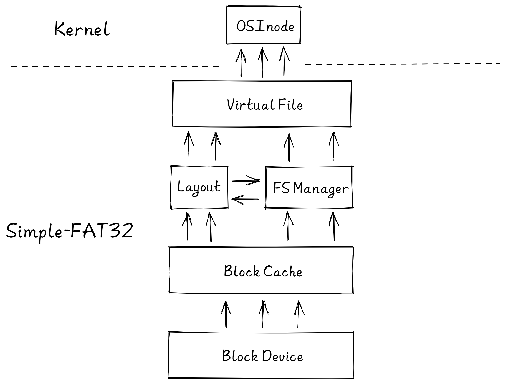
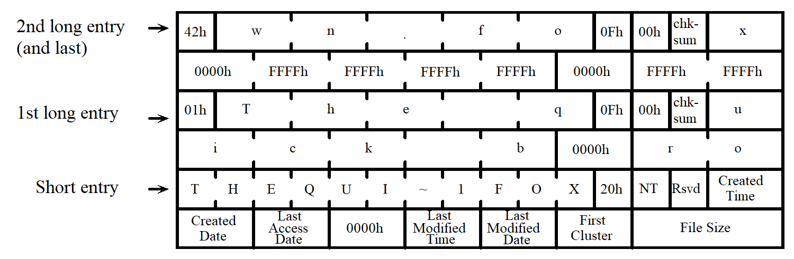
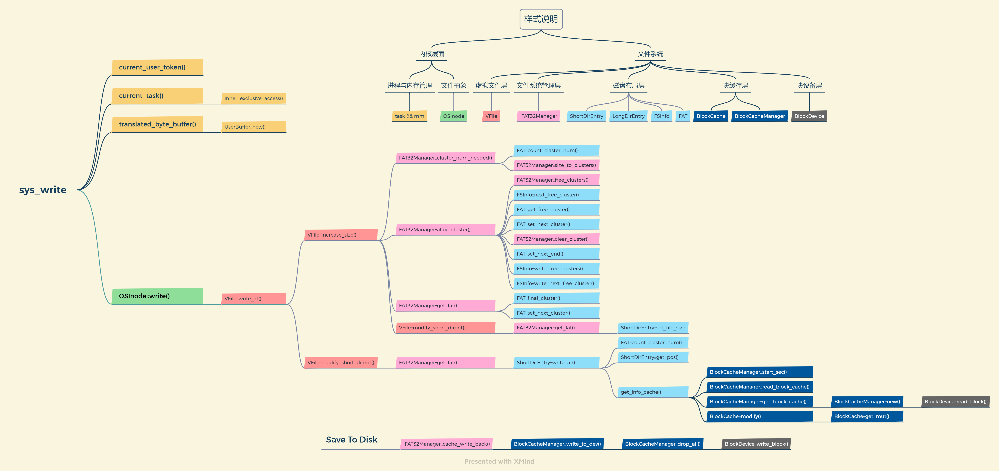

# 概览

由于 rCore-Tutorial-v3 中实现了一个简易的文件系统 easy-fs，其分层较为合理，因此 RongOS 所使用的 Simple-FAT32 文件系统在此基础上进行修改，使其符合 FAT32 文件系统的规格要求。

其次，Simple-FAT32 也借鉴了上一届 UltraOS 的 FAT32 实现，我们与 UltraOS 的开发者进行了积极的沟通与交流，对其一些不完善的地方进行改进，一些我们认为欠缺的地方进行重新设计。鉴于此，我们沿袭了其 FAT32 文件系统的名字，将我们的文件系统也命名为 Simple-FAT32 。



# 磁盘块设备接口层

定义了磁盘块的读写接口。

该 trait 仅需求两个函数 read_block 和 write_block ，分别代表将数据从块设备读到内存缓冲区中，或者将数据从内存缓冲区写回到块设备中，数据需要以块为单位进行读写。

在本次比赛中，实现 BlockDevice trait 的有两种类型：

- SDCardWrapper：K210 硬件平台的 MircoSD 抽象，用于在开发板上测试。
- VirtIOBlock：VirtIO 总线架构下的块设备抽象，用于在 Qemu 模拟器调试使用。

```rust
pub trait BlockDevice: Send + Sync + Any {
  fn read_block(&self, block_id: usize, buf: &mut [u8]);
  fn write_block(&self, block_id: usize, buf: &[u8]);
  fn handle_irq(&self);
}
```

# 块缓存层

当操作系统频繁读写磁盘块时，由于硬盘读写速度相较于内存是数量级上的差距，因此系统整体性能会受硬盘读写速度的牵制而极大降低。解决该问题最常见的手段就是引入缓存，将使用的磁盘块读到内存的一个缓冲区中，这个缓冲区中的内容是可以直接读写的，那么后续对这个数据块的大部分访问就可以在内存中完成了，这样就可以大幅提高 I/O 速度。当这个磁盘块不需要再被使用时（通常是由于长时间未使用而被替换算法选中），可以根据其内容是否有更改（或写回标志位）来决定是否将这片缓冲区中的内容写回磁盘。

基于这种想法，Simple-FAT32 中引入了块缓存层，其主要由两个结构体组成：

- BlockCache：块缓存结构体，是物理存储介质中一个块的映射。

  - cache：长度为 BLOCK_SIZE 的字符数组，磁盘块内容的实际存储位置。
  - block_id：保存当前块缓存在物理存储介质的实际块号，用于判断重复和数据写回。
  - block_device：当前块缓存所属的块设备引用，用于以后处理多个块设备的情况。
  - modified：更改标记，若当前块缓存的内容有更改需要写回磁盘，则值为 True。

  ```rust
  pub struct BlockCache {
      pub cache: [u8; BLOCK_SZ],
      block_id: usize,
      block_device: Arc<dyn BlockDevice>,
      modified: bool,
  }
  ```

- BlockCacheManager：块缓存管理器，用于实现块缓存的分配与回收等功能。

  - start_sec：扇区偏移量，当磁盘有分区时，对块设备的读写需要加上这个值。

    **注：扇区是磁盘物理层面的概念，而磁盘块是文件系统逻辑层面的概念，但由于目前磁盘块大小和扇区大小都是 512 字节，因此我们简单地将扇区概念等同于磁盘块的概念，下文将不再强调二者区别**

  - limit：块缓存上限，当块缓存数量达到上限时，需要使用替换算法进行淘汰。

  - queue：保存块缓存的双端队列，其中保存物理块号和对应块缓存的映射关系。

  ```rust
  pub struct BlockCacheManager {
      start_sec: usize,
      limit: usize,
      queue: VecDeque<(usize, Arc<RwLock<BlockCache>>)>,
  }
  ```

块缓存层对外主要提供 get_block_cache 接口，上层模块可以通过这个函数来获取对应物理块号的块缓存，随后调用块缓存的 read/modify 方法即可对存储设备的实际数据进行读取/修改，最后当块缓存的生命周期结束时，其会自动调用 sync 方法进行判断是否将内容写回磁盘。（ps：此处采用了 RAII 的想法）

```rust
pub fn get_block_cache(block_id: usize, block_device: Arc<dyn BlockDevice>) -> Arc<RwLock<BlockCache>>

pub fn read<T, V>(&self, offset: usize, f: impl FnOnce(&T) -> V) -> V

pub fn modify<T, V>(&mut self, offset: usize, f: impl FnOnce(&mut T) -> V) -> V
```

# 磁盘布局层

磁盘布局层是体现 FAT32 规范的关键，在这一层中会严格按照 FAT32 的标准进行数据结构的设计。

此层我们使用的**参考资料**为： [Microsoft Extensible Firmware Initiative FAT32 File System Specification(Version 1.03, December 6, 2000)](https://www.win.tue.nl/~aeb/linux/fs/fat/fatgen103.pdf)

一个 FAT 文件系统卷由四个基本区域组成，它们按此顺序排列在卷上：

- 保留区域
- FAT 区域
- 根目录区域（注意：这不存在于 FAT32 卷中）
- 文件和目录数据区域

因此 Simple-FAT32 中 FAT32 文件系统的磁盘布局如下图所示：


## 保留区域

关于保留区域我们还参考了 [OSDev Wiki](https://wiki.osdev.org/FAT) 的内容。

### BPB

保留区域的第一个扇区是 BPB(BIOS Parameter Block)，有时又称引导扇区或第0扇区。

该扇区前 36 个字节是 FAT12、FAT16、FAT32共有的 BPB 字段，从第 36 个字节起 FAT32 的扩展 BPB 字段将与 FAT12、FAT16不同，直至第 90 个字节。而后便是引导代码，最后以 0xAA55 作为结束标记。

BPB 字段中较为重要的有：

- BPB_BytsPerSec：每个扇区所包含的字节数量。
- BPB_SecPerClus：每个簇所包含的扇区数量。
- BPB_RsvdSecCnt：保留扇区的数目，通过它能获得第一个FAT所在的扇区，在 FAT32 中为 32 。
- BPB_NumFATs：FAT 文件系统中 FAT 的数量，通常为 2 。

扩展 BPB 字段中较为重要的有：

- BPB_FATSz32：一个 FAT 所占的扇区数
- BPB_FSInfo：FsInfo 结构在保留区域中的扇区号，通常为 1 。

对于 BPB 字段，Simple-FAT32 为其设计了完整的结构体，在读入时使用结构体映射的方式进行一一对应，由于这些变量只在最初读入 FAT32 文件系统信息时使用到，用完即释放，因此不会对内存造成非常大的负担。

### FsInfo

由于在 FAT32 卷上 FAT 可以是一个非常大的数据结构，因此 FAT32 设计了一个用来存储最后已知空闲簇号的字段，这样在 FAT32 API 调用时就无需重复计算有多少空闲的空间，加快了 FAT32 的处理效率。这一字段最后演变为 FsInfo 结构体，通常被存储在保留区域的 1 号扇区内（从 0 计数）。

FsInfo 结构体中较为重要的有：

- FSI_Free_Count：FAT32 卷上最近已知的空闲簇计数。
- FSI_Nxt_Free：最后被分配的簇号。

以上两个字段会在 FAT32 管理器进行簇的分配与回收过程中使用。

## 文件分配表

文件分配表 (File Allocation Table，FAT) 是存储在存储介质上的表，它指示磁盘上所有数据簇的状态和位置。 它可以被认为是磁盘的“目录”，由于 FAT 的存在，文件的簇就可以不必在磁盘上彼此相邻。

Simple-FAT32 中对 FAT 结构体的设计十分简单，仅两个整型用于表明 FAT 的起始扇区。

```rust
pub struct FAT {
    fat1_sector: u32,
    fat2_sector: u32,
}
```

但我们为其实现了非常多的提供给上层的接口：

- get_free_cluster：搜索下一个可用簇
- get_next_cluster：查询当前簇的下一个簇
- set_next_cluster：设置当前簇的下一个簇
- get_cluster_at：获取某个簇链的第 i 个簇
- final_cluster：获取某个簇链的最后一个簇
- get_all_cluster_of：获取某个簇链从指定簇开始的所有簇
- count_claster_num：获取某个簇链从指定簇开始到结尾的簇的数量

## 目录与文件

FAT 目录是一个由 32 字节结构的线性列表组成的文件。根目录是唯一一个必须始终存在的特殊目录。对于 FAT12 和 FAT16 ，根目录位于磁盘上紧跟着最后一个 FAT 的固定位置，并且根据 BPB_RootEntCnt 的值具有固定的大小。对于 FAT32 ，根目录是可变大小的，并且是一个簇链，就像其他普通的目录一样。FAT32 卷上根目录的第一个簇存储在 BPB_RootClus 中。与其他普通的目录不同，任何 FAT 类型上的根目录本身没有任何日期或时间戳，没有文件名(除了隐含的文件名\)，也不包含 . 和 .. 这两个特殊的应位于目录前两条的目录。

在 FAT 文件系统中，目录与在一个目录下的文件都称为常规文件，它们的区别仅仅体现在目录项的属性字段中，因此下文可能会将目录与文件这两个概念进行混用，读者只需明白它们只在一个字段上有差异即可。

#### 短文件名目录项

```rust
pub struct ShortDirEntry {
    dir_name: [u8; 8],      // 短文件名
    dir_extension: [u8; 3], // 扩展名
    dir_attr: u8,           // 文件属性
    dir_ntres: u8,          // 保留给 Windows NT 使用
    dir_crt_time_tenth: u8, // 文件创建的时间戳
    dir_crt_time: u16,      // 文件创建的时间
    dir_crt_date: u16,      // 文件创建的日期
    dir_lst_acc_date: u16,  // 上一次访问日期
    dir_fst_clus_hi: u16,   // 文件起始簇号的高 16位
    dir_wrt_time: u16,      // 上一次写入的时间
    dir_wrt_date: u16,      // 上一次写入的日期
    dir_fst_clus_lo: u16,   // 文件起始簇号的低 16位
    dir_file_size: u32,     // 文件大小（以字节为单位）
}
```

由于内核目前对时间支持得不完善，因此 Simple-FAT32 中没有对文件的各种时间做处理。

除了私有成员变量的访问与修改，短文件名目录项中较为重要的接口有：

- get_pos：获取文件偏移量所在的簇、扇区和偏移
- read_at：以偏移量读取文件
- write_at：以偏移量写文件

详细的过程信息与思路可以看代码中的注释，此处不再赘述。

#### 长文件名目录项

```rust
pub struct LongDirEntry {
    ldir_ord: u8,              // 长文件名目录项的序列号
    ldir_name1: [u8; 10],      // 5 个字符
    ldir_attr: u8,             // 长文件名目录项标志
    ldir_type: u8,             // 如果为零，则表示目录项是长文件名的一部分
    ldir_chksum: u8,           // 根据对应短文件名计算出的校验值
    ldir_name2: [u8; 12],      // 6 个字符
    ldir_fst_clus_lo: [u8; 2], // 文件起始簇号
    ldir_name3: [u8; 4],       // 2 个字符
}
```

长文件名目录项与短文件名目录项大小一致，也是 32 字节。

FAT32 对长文件名的定义是：文件名超出 8 个字节或扩展名超出 3 个字节。

长文件名目录项的特点：

- 为了低版本的OS或程序能正确读取长文件名文件，系统自动为所有长文件名文件创建了一个对应的短文件名，使对应数据既可以用长文件名寻址，也可以用短文件名寻址。不支持长文件名的OS或程序会忽略它认为不合法的长文件名字段，而支持长文件名的OS或程序则会以长文件名为显式项来记录和编辑，并隐藏短文件名。
- 长文件名的实现有赖于目录项偏移为 0xB 的属性字节（即 LDIR_Attr），当此字节的属性为：只读、隐藏、系统、卷标，即其值为 0FH 时，DOS和WIN32会认为其不合法而忽略其存在。这正是长文件名存在的依据。
- 系统将长文件名以 13 个字符为单位进行切割，每一组占据一个目录项。所以可能一个文件需要多个目录项，这时长文件名的各个目录项按倒序排列在目录表中，以防与其他文件名混淆。长文件名的第一部分距离短文件名目录项是最近的。
- 系统在存储长文件名时，总是先按倒序填充长文件名目录项，然后紧跟其对应的短文件名。长文件名中并不存储对应文件的文件开始簇、文件大小、各种时间和日期属性。文件的这些属性还是存放在短文件名目录项中，一个长文件名总是和其相应的短文件名一一对应，短文件名没有了长文件名还可以读，但长文件名如果没有对应的短文件名，不管什么系统都将忽略其存在，所以短文件名是至关重要的。

**长短文件名的配对**

长文件名和短文件名之间的联系光靠他们之间的位置关系维系是远远不够的。此时需要用到长文件名的 0xD 字节（即 LDIR_Chksum），此校验和是用短文件名的11个字符通过一种运算方式来得到的。系统根据相应的算法来确定相应的长文件名和短文件名是否匹配。如果通过短文件名计算出来的校验和与长文件名中的 0xD 偏移处数据不相等，那么系统不会将它们进行配对。

**举例：长文件名目录项的填充与排布**

文件名：The quick brown.fox



#### 关于文件名大小写的问题

我们在实际测试中发现，Linux 对于短文件名文件也会创建一个长文件名目录项，以此来区分文件名的大小写（因为短文件名目录项中只存放大写，就无法判断字符的大小写情况，而微软使用了 DIR_NTRes 这一字段来标明文件名的大小写情况）。Simple-FAT32 中没有对文件名大小写进行检查，因此也不会为短文件名文件自动创建长文件名目录项，这样的做法使得 Simple-FAT32 ”兼容“了 Linux 和微软的两种标准。

# 文件系统管理层

文件系统管理层的主要作用：

- 启动文件系统：读取 FAT 保留区域的数据，并进行校验，获取 FsInfo 与 FAT 的引用供其他层使用。
- 管理磁盘上的簇：负责簇的分配、回收与清空
- 提供工具函数：如长文件名拆分、根据给定的字节数量求出需要的簇数等

```rust
pub struct FAT32Manager {
    block_device: Arc<dyn BlockDevice>,       // 块设备的引用
    fsinfo: Arc<RwLock<FSInfo>>,              // 文件系统信息扇区的引用
    sectors_per_cluster: u32,                 // 每个簇的扇区数
    bytes_per_sector: u32,                    // 每个扇区的字节数
    bytes_per_cluster: u32,                   // 每个簇的字节数
    fat: Arc<RwLock<FAT>>,                    // FAT的引用
    root_sec: u32,                            // 根目录所在簇号
    vroot_dirent: Arc<RwLock<ShortDirEntry>>, // 虚拟根目录项
}
```

FAT32Manager 提供的重要接口有：

- open：打开现有的 FAT32 文件系统
- alloc_cluster：分配指定数量的簇
- dealloc_cluster：回收给定的簇

另外工具类函数有：

- 计算相关：
  - first_sector_of_cluster：获取某个簇的第一个扇区
  - size_to_clusters：根据给定的字节数量求出需要的簇数
  - cluster_num_needed：计算扩大至 new_size 需要多少个簇
- 文件名相关：
  - split_name_ext：拆分文件名和后缀
  - short_name_format：将短文件名格式化为目录项存储的内容
  - generate_short_name：由长文件名生成短文件名
  - long_name_split：将长文件名拆分，返回字符串数组

# 虚拟文件层

可以不必过多关注此层的名称，原 easy-fs 中称为索引节点层，UltraOS 中称虚拟文件系统层。不论叫什么，这层的设计思想是为了让那些不关心磁盘布局具体实现的文件系统的使用者（操作系统内核）能便捷地对文件和目录进行操作，即屏蔽了文件系统的内部细节，抽象出一个虚拟文件提供给内核使用。

虚拟文件层主要设计了一个文件抽象，实现了文件创建、清空、删除、查找、读取、写入等直接提供给操作系统内核调用的接口。

```rust
pub struct VFile {
    name: String,                       // 文件名
    short_sector: usize,                // 文件短目录项所在扇区
    short_offset: usize,                // 文件短目录项所在扇区的偏移
    long_pos_vec: Vec<(usize, usize)>,  // 长目录项的位置<sector, offset>
    attribute: u8,                      // 文件属性
    fs: Arc<RwLock<FAT32Manager>>,      // 文件系统引用
    block_device: Arc<dyn BlockDevice>, // 块设备引用
}
```

VFile 中有一些对下层接口的封装（都是私有函数，仅结构体内部使用）：

- read_short_dirent：获取短文件名目录项内容的不可变引用
- modify_short_dirent：获取短文件名目录项内容的可变引用
- modify_long_dirent：获得长文件名目录项内容的可变引用
- get_pos：获取文件偏移量所在的扇区和偏移
- first_cluster：获取文件的第一个簇
- increase_size：对文件进行扩容，new_size 是文件当前偏移量加 buf 长度

VFile 最终提供给文件系统使用者的接口（即 Simple-FAT32 目前能提供的所有功能）：

- name：获取文件名
- file_size：获取文件大小
- is_dir：判断文件是否为目录文件
- is_short：判断文件是否为短文件名文件
- read_at：以偏移量读取文件内容保存到缓冲区中
- write_at：以偏移量将缓冲区中的数据写入到文件中
- create：在当前目录下创建文件
- find_vfile_bypath：根据给定路径在当前目录下搜索文件
- clear：清空文件内容
- remove：删除文件
- stat：获取文件状态信息
- dirent_info：获取目录文件的目录项信息

最后，在内核的 inode 文件中，接入 Simple-FAT32 的类型、常量、函数如下：

```rust
use simple_fat32::{FAT32Manager, VFile, ATTR_ARCHIVE, ATTR_DIRECTORY,create_root_vfile};
```

可以看出五级分层设计能很大程度上简化使用者的编程难度，几乎只需要接入 VFile 这个类型。

# 以 sys_write 为例的系统调用过程



