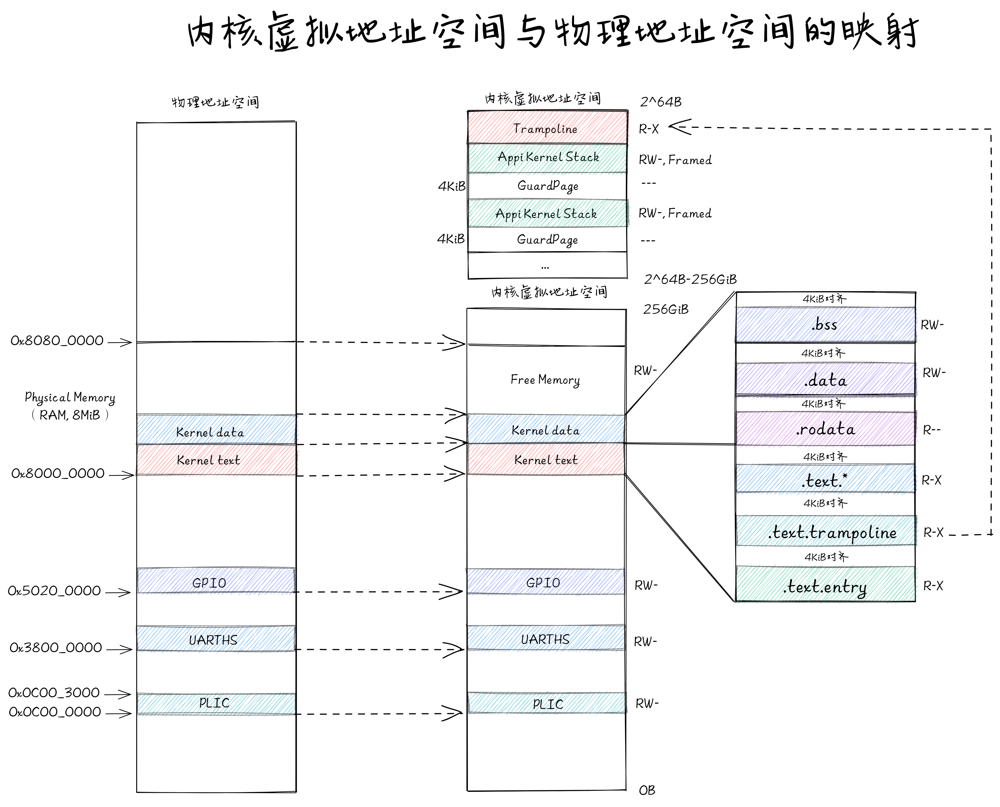
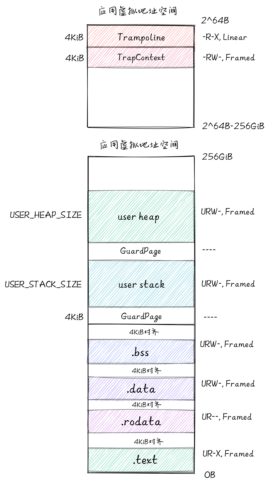
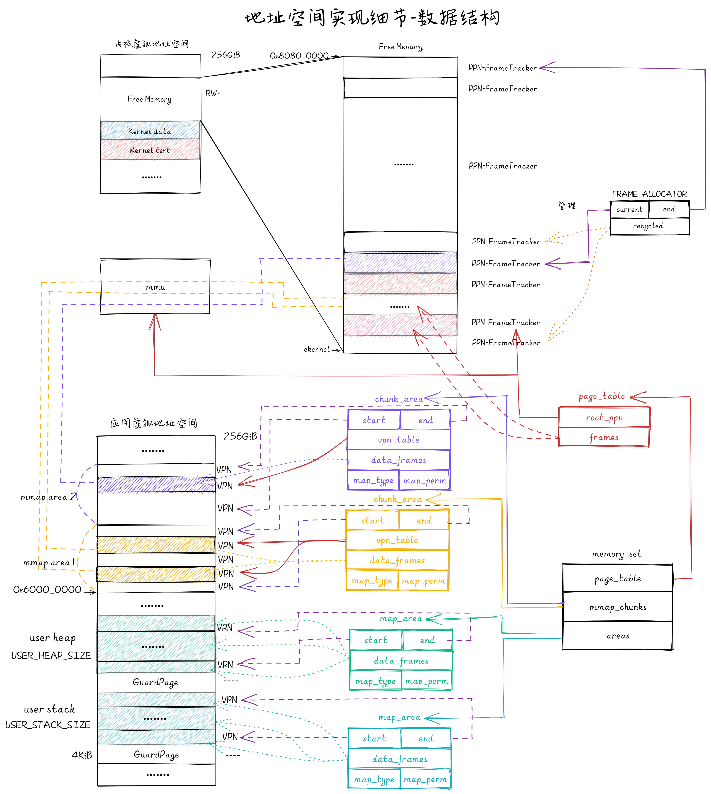

# 内存管理
内存管理主要分为地址空间和页表结构。其作用就是对物理内存增加一层抽象，为操作系统上层的应用提供一个抽象接口，同时操作系统还能有效检测并阻止非法读取内存数据的行为。RongOS内核为了实现对有限内存尽可能高效的利用引入了分页内存管理功能和Lazy机制，为了支持分时多任务并发内存安全的特性引入了地址空间的概念。
## 分页内存管理与页表
RongOS内核以页为单位进行内存管理，默认页面大小为4KiB，支持RISC-V SV39多级页表，相比分段内存管理，分页内存管理的粒度更小且大小固定，这样页内部没有被用到的内碎片的大小也更小，提高了内存利用率。

为了方便实现虚拟页面到物理页帧的地址转换，我们给每个虚拟页面和物理页帧一个编号，分别称为 `虚拟页号 (VPN, Virtual Page Number)` 和 `物理页号 (PPN, Physical Page Number)` 。每个应用都有一个表示地址映射关系的 `页表 (Page Table)` ，里面记录了该地址空间中的每个虚拟页面映射到物理内存中的哪个物理页帧。我们可以用页号来代表二者，因此如果将页表看成一个键值对，其键的类型为虚拟页号，值的类型则为物理页号。

在页表中，还针对虚拟页号设置了一组保护位，它限制了应用对转换得到的物理地址对应的内存的使用方式。最典型的如 RWX ， R 表示当前应用可以读该内存； W 表示当前应用可以写该内存； X 则表示当前应用可以从该内存取指令用来执行。一旦违反了这种限制则会触发异常，并被内核捕获到。通过适当的设置，可以检查一些应用在运行时的明显错误：比如应用修改只读的代码段，或者从数据段取指令来执行。

## 地址空间
地址空间作为内存的抽象，可以为每个程序（包括内核代码）创建一个相互隔离的内存空间，从而解决了以下两个问题：
- 地址暴露问题：如果用户程序可以寻址内存的每个字节，它们就可以很容易地（故意地或偶然地）破坏操作系统，从而使系统慢慢地停止运行。即使在只有一个用户进程运行的情况下，这个问题也是存在的。引入地址空间后进程无法访问其他进程的内存空间，可以防止数据泄露和恶意代码的破坏。
- 程序重定向问题：在未引入地址空间之前，每段程序必须加载到不同的内存地址上，虽然可以通过重定位的方式加载，但这是一个缓慢且复杂的动作；引入地址空间之后，程序可以加载到位于不同地址空间的同一个虚拟地址上，从而省去了重定向的过程。

同时地址空间也引入了用时分配的思想，即地址空间为每个进程提供了512GiB的可寻址虚拟内存大小，但是只有在程序需要读写某块虚拟内存时相应的物理内存才会被分配给这一地址空间，这一特性将在mmap的实现中详细说明。

## RongOS 地址空间设计概览
### 内核地址空间

当计算机控制权由RustSBI交给RongOS内核后，内核便会开始创建内核虚拟空间，在内核空间中除了跳板和应用内核栈外其余内存地址均采用恒等映射。其中，物理地址范围 `[0x0C00_0000,0x5020_0000]` 内的若干段内存空间是硬件MMIO区域；物理地址范围 `[0x8000_0000,0x8080_0000]` 内的内存空间为K210的8MiB内存，内核数据区结束地址 `ekernel` 会在内核链接脚本中给出；物理地址范围 `[ekernel, 0x8080_0000]` 会在恒等映射后全部交给 全局物理页帧管理器 `FRAME_ALLOCATOR` 由其负责页面的分配和回收。

### 应用地址空间

应用地址空间会在应用加载时创建，其中，`.text段`, `.rodata段`, `.data段`, `.bss段`的范围与数据由ELF文件或另一应用地址空间给出；`user stack段` 使用一页 `GuardPage` 与 `.bss段` 分离，用作用户栈空间；`user heap段` 使用一页 `GuardPage` 与 `user stack段` 分离，用作用户堆空间。

## RongOS 分页内存管理实现细节
### 地址相关的数据结构抽象与类型定义
```rust
#[derive(Copy, Clone, Ord, PartialOrd, Eq, PartialEq)]
pub struct PhysAddr(pub usize);

#[derive(Copy, Clone, Ord, PartialOrd, Eq, PartialEq)]
pub struct VirtAddr(pub usize);

#[derive(Copy, Clone, Ord, PartialOrd, Eq, PartialEq)]
pub struct PhysPageNum(pub usize);

#[derive(Copy, Clone, Ord, PartialOrd, Eq, PartialEq)]
pub struct VirtPageNum(pub usize);
```
上面分别给出了物理地址、虚拟地址、物理页号、虚拟页号的 Rust 类型声明，它们都是 Rust 的元组式结构体，可以看成 usize 的一种简单包装。我们刻意将它们各自抽象出不同的类型而不是都使用与RISC-V 64硬件直接对应的 usize 基本类型，就是为了在 Rust 编译器的帮助下，通过多种方便且安全的 类型转换 (Type Conversion) 来构建页表。

### 物理页帧和物理页帧管理器
我们将物理页帧抽象为 `FrameTracker` 结构体，这样就可以利用Rust语言特性实现在 `FrameTracker` 结构体创建时初始化内存空间，在 `FrameTracker` 结构体生命周期结束后回收物理页帧的功能。 实现代码如下：

```rust
pub struct FrameTracker {
    pub ppn: PhysPageNum,
}

impl FrameTracker {
    /// 通过物理页号创建一个物理页帧的结构体，创建时初始化内存空间
    pub fn new(ppn: PhysPageNum) -> Self {
        let bytes_array = ppn.get_bytes_array();
        for i in bytes_array {
            *i = 0;
        }
        Self { ppn }
    }
}

impl Drop for FrameTracker {
    fn drop(&mut self) {
        frame_dealloc(self.ppn);
    }
}
```

物理页帧管理器向内核提供 `new()` 、 `alloc()` 和 `dealloc()` 接口，分别用于初始化物理页帧管理器、分配和回收物理页帧；为了支持多种物理页帧管理方法，我们将接口抽象为 `trait`，再由具体的物理页帧管理器实现这写接口。目前RongOS采用栈式物理页帧管理方案：利用 `current` , `end` 字段限定物理页帧管理器管理的内存空间范围，内核初始化时会将除内核代码所占空间之外的剩余物理内存交给物理页帧管理器管理；利用 `recycled` 字段以栈式结构存放被回收的物理页帧，在下次分配时如果该字段非空，则优先使用该字段栈顶的物理页帧。实现代码如下：
```rust
trait FrameAllocator {
    fn new() -> Self;
    fn alloc(&mut self) -> Option<PhysPageNum>;
    fn dealloc(&mut self, ppn: PhysPageNum);
}

impl Drop for FrameTracker {
    fn drop(&mut self) {
        frame_dealloc(self.ppn);
    }
}

pub fn frame_dealloc(ppn: PhysPageNum) {
    FRAME_ALLOCATOR.exclusive_access().dealloc(ppn);
}

pub struct StackFrameAllocator {
    current: usize,
    end: usize,
    recycled: Vec<usize>,
}

impl StackFrameAllocator {
    pub fn init(&mut self, l: PhysPageNum, r: PhysPageNum) {
        self.current = l.0;
        self.end = r.0;
    }
}
impl FrameAllocator for StackFrameAllocator {
    fn new() -> Self {
        Self {
            current: 0,
            end: 0,
            recycled: Vec::new(),
        }
    }
    fn alloc(&mut self) -> Option<PhysPageNum> {
        // 首先检查栈 recycled 内有没有之前回收的物理页号，如果有的话直接弹出栈顶并返回
        if let Some(ppn) = self.recycled.pop() {
            Some(ppn.into())
        }   // 空间满返回 None
        else if self.current == self.end {
            None
        }   // 否则就返回最低的物理页号
        else {
            self.current += 1;
            Some((self.current - 1).into())
        }
    }
    fn dealloc(&mut self, ppn: PhysPageNum) {
        let ppn = ppn.0;
        // 验证物理页号有效性，PPN大于已分配的最高内存或已释放栈中存在这个物理页号
        if ppn >= self.current || self.recycled.iter().any(|&v| v == ppn) {
            panic!("Frame ppn={:#x} has not been allocated!", ppn);
        }
        self.recycled.push(ppn);    // 回收，压栈
    }
}
```
在结构体设计中我们利用Rust语言的生命周期和所有权机制来实现结构体的自动回收功能，Rust中每个变量都有且只有一个所有者，当所有者离开作用域，变量会被自动释放/析构。因此我们只需定义变量析析构时具体动作，而不需要手动进行变量析构。以上代码为物理页帧的析构过程，当物理页帧生命周期结束后，内核会自动调用 `FrameTracker::drop()` 函数开始对物理页帧的析构，经过两次函数调用后由栈式物理页帧管理器在验证物理页帧有效性后，将此物理页帧的物理页号压入回收物栈中供下次分配使用。

### 页表项的数据结构抽象与类型定义

上图为 SV39 分页模式下的页表项，其中 `[63:54]` 这10位保留不用， `[53:10]` 这44位是物理页号，最低的8位 `[7:0]` 则是标志位，它们的含义如下：

- `V(Valid)`：仅当位 V 为 1 时，页表项才是合法的；
- `R(Read)/W(Write)/X(eXecute)`：分别控制索引到这个页表项的对应虚拟页面是否允许读/写/执行；
- `U(User)`：控制索引到这个页表项的对应虚拟页面是否在 CPU 处于 U 特权级的情况下是否被允许访问；
- `A(Accessed)`：处理器记录自从页表项上的这一位被清零之后，页表项的对应虚拟页面是否被访问过；
- `D(Dirty)`：处理器记录自从页表项上的这一位被清零之后，页表项的对应虚拟页面是否被修改过。

```rust
#[derive(Copy, Clone)]
#[repr(C)]
pub struct PageTableEntry {
    pub bits: usize,
}

impl PageTableEntry {
    pub fn new(ppn: PhysPageNum, flags: PTEFlags) -> Self {
        PageTableEntry {
            bits: ppn.0 << 10 | flags.bits as usize,
        }
    }
}
```
以上代码块为页表项数据结构的具体实现，我们使用名为 `PageTableEntry` 的结构体包含了一个 `usize` 类型，用以存储页表项的64位数据；成员函数 `PageTableEntry::new()` 提供了将物理页号和页表项标志位按比特写入物理空间的功能。通过分析 `PageTableEntry` 结构体和页表大小可知，每个 `PageTableEntry` 结构体占用64bit空间，页大小在内核中定义为 4KiB，每个物理页可以存放512个 `PageTableEntry` 结构体。

## RongOS 地址空间实现细节

| 结构体      | 名称                 | 逻辑功能                                                                                                                                                                                                                                                                                                |
| ----------- | -------------------- | ------------------------------------------------------------------------------------------------------------------------------------------------------------------------------------------------------------------------------------------------------------------------------------------------------- |
| `MemorySet` | 地址空间             | 数据结构如上图右下角所示，由页表、连续逻辑段和离散逻辑段组成，用于整体描述上图左下角所示的应用虚拟地址空间                                                                                                                                                                                              |
| `MapArea`   | (虚拟地址)连续逻辑段 | 数据结构如上图中下部所示，<br>`start`,`end`字段用于描述连续逻辑段虚拟页号范围；<br>`data_frame`字段用于存放连续逻辑段中物理页帧对应的 `Frame_tracker`；<br>`map_type`,`map_perm` 分别表示内存空间映射方法和内存空间权限；                                                                               |
| `ChunkArea` | (虚拟地址)离散逻辑段 | 数据结构如上图中部所示，<br>`start`,`end`字段用于描述离散逻辑段虚拟页表范围；<br>`vpn_table`字段用于存放离散逻辑段中已被映射的物理页帧对应的 `Frame_tracker`；<br>`data_frame`字段用于存放离散逻辑段中物理页帧对应的 `Frame_tracker`;<br>`map_type`,`map_perm` 分别表示内存空间映射方法和内存空间权限； |
| `PageTable` | SV39多级页表         | 数据结构如上图右侧中部所示，<br>`root_ppn`字段表示多级页表更页面的物理页号；<br>`frames`字段用于保存页表项所在页对应的`Frame_tracker`                                                                                                                                                                   |

### 页表

上图为 SV39 地址转换的全过程图示，页表的功能就是管理存有页表项的物理页帧，通过对页表项的修改实现地址映射的修改。
```rust
pub struct PageTable {
    root_ppn: PhysPageNum,
    frames: Vec<FrameTracker>,
}
```
以上为页表结构体的定义，其中 `root_ppn` 字段是页表根页面对应的物理页号，只有将其格式化并写入satp寄存器后SV39多级页表才会被正式启用，使用不同的 `root_ppn` 格式化并写入 satp 寄存器便可完成页表的切换，从而实现地址空间的切换。

```rust
impl PageTable {

    fn find_pte_create(&mut self, vpn: VirtPageNum) -> Option<&mut PageTableEntry> {
        let idxs = vpn.indexes();
        let mut ppn = self.root_ppn;
        let mut result: Option<&mut PageTableEntry> = None;
        for (i, idx) in idxs.iter().enumerate() {
            // 通过 get_pte_array 将取出当前节点的页表项数组，并根据当前级页索引找到对应的页表项
            let pte = &mut ppn.get_pte_array()[*idx];
            if i == 2 {
                // 找到第三级页表，这个页表项的可变引用
                result = Some(pte);
                break;
            }
            if !pte.is_valid() {        // 发现页表项是无效的状态
                let frame = frame_alloc().unwrap(); // 获取一个物理页帧
                *pte = PageTableEntry::new(frame.ppn, PTEFlags::V); // 用获取到的物理页帧生成新的页表项
                self.frames.push(frame);// 将生成的页表项存入页表
            }
            ppn = pte.ppn();            // 切换到下一级页表（物理页帧）
        }
        result
    }
    
    pub fn map(&mut self, vpn: VirtPageNum, ppn: PhysPageNum, flags: PTEFlags) {
        let pte = self.find_pte_create(vpn).unwrap();
        assert!(!pte.is_valid(), "vpn {:?} is mapped before mapping", vpn);
        *pte = PageTableEntry::new(ppn, flags | PTEFlags::V);
    }

    pub fn unmap(&mut self, vpn: VirtPageNum) {
        let pte = self.find_pte(vpn).unwrap();
        assert!(pte.is_valid(), "vpn {:?} is invalid before unmapping", vpn);
        *pte = PageTableEntry::empty();
    }
}
```
以上代码为页表新增映射和删除映射的具体实现，`PageTable::find_pte_create()` 函数通过三级页表查找虚拟页号对应的第三级页表项，在查找过程中如果遇到页表项是无效状态的，便申请一个物理页帧，用获取到的物理页帧生成新的页表项，以继续完成查找过程。`PageTable::map()` 函数通过调用 `PageTable::find_pte_create()` 函数获取虚拟页号对应的第三级页表项，将映射的物理页号写入第三级页表项便可实现地址映射。`PageTable::unmap()` 函数通过将第三级页表项清零完成地址映射的删除。

### 逻辑段
逻辑段根据其虚拟地址空间中页面是否会被一次性连续映射分为连续逻辑段和离散逻辑段；类似于进程代码空间和堆栈空间会在进程创建是创建逻辑段时会被全部映射到虚拟地址空间的连续逻辑段，类似于 `mmap area` 这样的发生缺页异常才尝试进行加载的属于离散逻辑段。在逻辑段结构设计中连续逻辑段因页面会被连续映射，在连续逻辑段结构体中只需保存连续逻辑段起止虚拟页号便可确定逻辑段范围；而离散逻辑段中页面只有在发生缺页异常后才会被加载，虚拟地址空间中页面不是连续的，故在离散逻辑段结构体中还需保存已加载的页面对应的虚拟页号。

```rust
impl MapArea {
    fn map_one(&mut self, page_table: &mut PageTable, vpn: VirtPageNum) {
        let ppn: PhysPageNum;
        match self.map_type {
            MapType::Identical => {
                ppn = PhysPageNum(vpn.0);
            }
            MapType::Framed => {
                let frame = frame_alloc().unwrap();
                ppn = frame.ppn;
                self.data_frames.insert(vpn, frame);
            }
        }
        let pte_flags = PTEFlags::from_bits(self.map_perm.bits).unwrap();
        page_table.map(vpn, ppn, pte_flags);
    }

    fn unmap_one(&mut self, page_table: &mut PageTable, vpn: VirtPageNum) {
        if self.map_type == MapType::Framed {
            self.data_frames.remove(&vpn);
        }
        page_table.unmap(vpn);
    }

    pub fn map(&mut self, page_table: &mut PageTable) {
        for vpn in self.vpn_range {
            self.map_one(page_table, vpn);
        }
    }

    pub fn unmap(&mut self, page_table: &mut PageTable) {
        for vpn in self.vpn_range {
            self.unmap_one(page_table, vpn);
        }
    }
}
```
以上代码为连续逻辑段建立映射的代码，`MapArea::map()` 循环调用 `MapArea::map_one()` 映射一页，实现连续地址的映射。 `MapArea::map_one()` 首先判断逻辑段的映射方式，如果为恒等映射就令物理页号和虚拟页号相同，如果为随机映射则函数为每一个虚拟页向物理页帧管理器申请一个物理页帧，然后在页表中建立映射。

### 地址空间
地址空间便是页表、连续逻辑段和离散逻辑段的综合，以下为地址空间定义：
```rust
pub struct MemorySet {
    page_table: PageTable,
    areas: Vec<MapArea>,
    mmap_chunks: Vec<ChunkArea>,
}

impl MemorySet {
    pub fn new_kernel() -> Self { ... }
    pub fn from_elf(elf_data: &[u8]) -> (Self, usize, usize, usize) { ... }
    pub fn from_existed_user(user_space: &MemorySet) -> MemorySet { ... }
}
```
以上代码给出了地址空间生成的三种方式，分别为为内核生成内核地址空间、从ELF文件生成地址空间和从已有用户程序复制地址空间，这三种地址空间生成方式分别用在内存管理初始化、exec和fork中。
